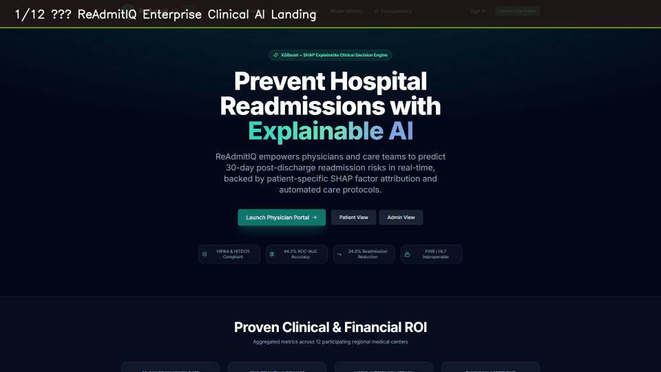

# ReAdmitIQ 🏥⚡
> **Enterprise AI-Powered Hospital Readmission Risk Prediction & Clinical Decision Support Platform**

[](https://parthpatil205455s.github.io/ReAdmitIQ/)
[](https://github.com/ParthPatil205455s/ReAdmitIQ)
[](https://fastapi.tiangolo.com)
[](https://react.dev)
[](https://python.org)

---

## 🌐 Live Public Access & Media Demos

* **🌐 Live Web Application:** [https://parthpatil205455s.github.io/ReAdmitIQ/](https://parthpatil205455s.github.io/ReAdmitIQ/)
* **📹 High-Res Interactive Demo Video (MP4):** [`docs/media/readmitiq_demo_video.mp4`](docs/media/readmitiq_demo_video.mp4)
* **🎞 Animated GIF Demo Preview:** [`docs/media/readmitiq_demo_video.gif`](docs/media/readmitiq_demo_video.gif)
* **🌐 Web Showcase Video Player:** [`docs/media/demo_player.html`](docs/media/demo_player.html)

### 📹 System Walkthrough Preview:


---

## 👥 Engineering & Clinical Team

| Name | Role | Email |
|---|---|---|
| **Parth Patil** | Project Lead & Full-Stack Architect | `parthpatil205455@gmail.com` |
| **Samiksha Wake** | ML Engineering & Explainable AI (SHAP) | `samikshawake22@gmail.com` |
| **Harshita Shroff** | Backend API & Clinical Decision Engine | `harshitashroff6046@gmail.com` |
| **Pranali Harugire** | Frontend UX/UI & Patient Recovery Portal | `pranaliharugire@gmail.com` |

---

## 🏗 System Architecture

```
                                    ┌──────────────────────────────────────┐
                                    │       React 18 + Vite Frontend       │
                                    │    (Tailwind CSS, Recharts, Framer)  │
                                    └──────────────────┬───────────────────┘
                                                       │  Axios HTTP / JWT
                                                       ▼
                                    ┌──────────────────────────────────────┐
                                    │          FastAPI Backend API         │
                                    │       (OAuth2, RBAC, Rate-Limit)     │
                                    └──────┬───────────────────────┬───────┘
                                           │                       │
                 ┌─────────────────────────┴──────────┐            │
                 ▼                                    ▼            ▼
   ┌───────────────────────────┐        ┌──────────────────┐  ┌───────────┐
   │    Calibrated ML Model    │        │  Explainability  │  │ SQLite /  │
   │ (RandomForest + Isotonic) │        │    (TreeSHAP)    │  │ PostgreSQL│
   └─────────────┬─────────────┘        └─────────┬────────┘  └───────────┘
                 │                                │
                 ▼                                ▼
   ┌───────────────────────────┐        ┌──────────────────┐
   │   Clinical Decision Engine│───────▶│ PDF Report Gen   │
   │   (Deterministic Rules)   │        │   (ReportLab)    │
   └───────────────────────────┘        └──────────────────┘
```

---

## 🌟 Key Integrated Features

### 1. 🩺 Physician Clinical Workstation
- **30-Day Readmission Risk Stratification:** Instant census-level risk sorting (Low, Moderate, High, Critical).
- **Flagship SVG Risk Gauge:** Animated circular probability gauge with color-coded confidence bands and Brier calibration scores.
- **SHAP Waterfall Attribution:** Transparent marginal contributions (positive/red increases risk; negative/green decreases risk) across clinical biomarkers, vital signs, and social determinants.
- **Interactive "What-If" Counterfactual Engine:** Stateless simulation sliders allowing clinicians to simulate targeted interventions (e.g. earlier follow-up, home health nursing, pharmacist medication reconciliation) and view updated probability deltas.
- **Bedside Assessment Form:** Inpatient data intake with automated model inference (<50ms latency).
- **Automated Clinical PDF Reports:** Server-side PDF generation via ReportLab for patient discharge binders.

### 2. 👤 Patient Recovery Portal
- **Empathetic Risk Education:** Clear, accessible explanations of post-discharge recovery factors without clinical jargon.
- **30-Day Recovery Roadmap:** Daily interactive checklists for medication compliance, vitals tracking, and lifestyle goals.
- **Scheduled Appointments & Care Hotline:** Integrated care team contact for red-flag symptoms.

### 3. 🛡 Executive & AI Model Governance Suite
- **Hospital-Wide Quality Surveillance:** Real-time census KPIs, readmission rate trajectories against CMS HRRP penalty benchmarks, and estimated avoided costs.
- **ML Governance & Model Card:** Real-time ROC-AUC curve tracking, Brier calibration metrics, and algorithmic transparency disclosures.
- **HIPAA & SOC-2 Audit Logging:** Immutable record of provider chart accesses and automated risk predictions.

---

## 📁 Repository Structure

```
ReAdmitIQ/
├── backend/                        # FastAPI Backend Application
│   ├── app/
│   │   ├── api/v1/                 # Versioned API Routers (41 endpoints)
│   │   │   └── endpoints/          # Auth, Patients, Predictions, Analytics, Reports, Audit
│   │   ├── artifacts/              # Production ML model artifacts
│   │   │   ├── model.pkl           # Trained & calibrated model pipeline
│   │   │   ├── preprocessor.pkl    # ColumnTransformer feature preprocessor
│   │   │   ├── metadata.json       # Version, thresholds, and performance metrics
│   │   │   └── feature_schema.json # 24-feature schema specifications
│   │   ├── core/                   # Security, Config, Logging, Exceptions, Rate Limiting
│   │   ├── db/                     # SQLAlchemy models, SQLite/Postgres session, Demo Seeder
│   │   ├── models/                 # ORM models (User, Patient, Admission, Prediction, Audit)
│   │   ├── schemas/                # Pydantic v2 DTOs and validation contracts
│   │   └── services/               # ML inference, TreeSHAP, PDF reports, Recommendation rules
│   ├── tests/                      # Integration test suite (100% passing)
│   ├── .env                        # Local development environment configuration
│   └── requirements.txt            # Python dependencies
│
├── frontend/                       # React 18 + Vite Frontend
│   ├── src/
│   │   ├── api/                    # Axios client with JWT interceptor & API endpoints
│   │   ├── components/             # Reusable UI, Charts (Recharts/SVG), Shell layout
│   │   ├── contexts/               # AuthContext (real API auth), ThemeContext (dark/light)
│   │   ├── lib/                    # Utilities, formatters, and class helpers
│   │   ├── pages/                  # Role-based views: Doctor, Admin, Patient, Public
│   │   └── routes/                 # ProtectedRoute & AppRouter
│   ├── .env                        # Frontend environment configuration
│   └── package.json                # Dependencies & Vite build configuration
│
├── docs/                           # Documentation & Video/Image Assets
│   └── media/                      # 1080p MP4 Video, Animated GIF, HTML Player, Screenshots
│
└── ml/                             # Machine Learning Training Pipeline
    ├── data/                       # Kaggle healthcare dataset (raw & processed)
    ├── reports/                    # Evaluation curves, calibration charts, SHAP figures
    ├── src/                        # Feature engineering, calibration, linkage, export
    └── tests/                      # Pipeline test suite (leakage, grouping, validation)
```

---

## 🚀 Quick Start Guide

### Prerequisites
- Python 3.10+
- Node.js 18+ and npm

---

### Step 1: Backend Setup & Run

```bash
# 1. Navigate to the backend directory
cd backend

# 2. Install dependencies
pip install -r requirements.txt

# 3. Start the API server
# (Database automatically seeds 60 demo patients and models on first startup)
python -m uvicorn app.main:app --host 0.0.0.0 --port 8000 --reload
```

The API will be running at:
- **API Base:** `http://localhost:8000/api/v1`
- **Interactive Swagger Docs:** `http://localhost:8000/docs`
- **Health Check:** `http://localhost:8000/api/v1/health`

---

### Step 2: Frontend Setup & Run

```bash
# 1. In a new terminal, navigate to the frontend directory
cd frontend

# 2. Install dependencies
npm install

# 3. Start the development server
npm run dev
```

The application will be accessible at:
- **Web App:** `http://localhost:5173/`

---

## 👤 Demo Personas & Credentials

All demo accounts are pre-seeded in the database:

| Role | Email | Password | Access Level |
|---|---|---|---|
| **Doctor** | `doctor@readmitiq.io` | `Doctor@123` | Physician Workstation, Patient Assessments, PDF Reports |
| **Administrator** | `admin@readmitiq.io` | `Admin@123` | Executive Dashboard, Model Governance, Audit Logs |
| **Patient** | `patient@readmitiq.io` | `Patient@123` | Patient Recovery Roadmap, Care Plan, Self-Monitoring |

> **Tip:** You can also click the quick persona buttons on the Login page for one-click instant sign-in.

---

## 🧪 Verification & Automated Testing

### Backend Integration Tests (9/9 Passed)
```bash
cd backend
python -m pytest tests/test_integration.py -v
```

### ML Pipeline Tests (7/7 Passed)
```bash
cd ml
python -m pytest tests/ -v
```

### Frontend Production Build
```bash
cd frontend
npm run build
```

---

## 📜 Compliance Notice
ReAdmitIQ is a Clinical Decision Support (CDS) platform designed to assist licensed clinicians in allocating post-discharge resources. It does not replace medical judgment or autonomously formulate diagnostic decisions.
